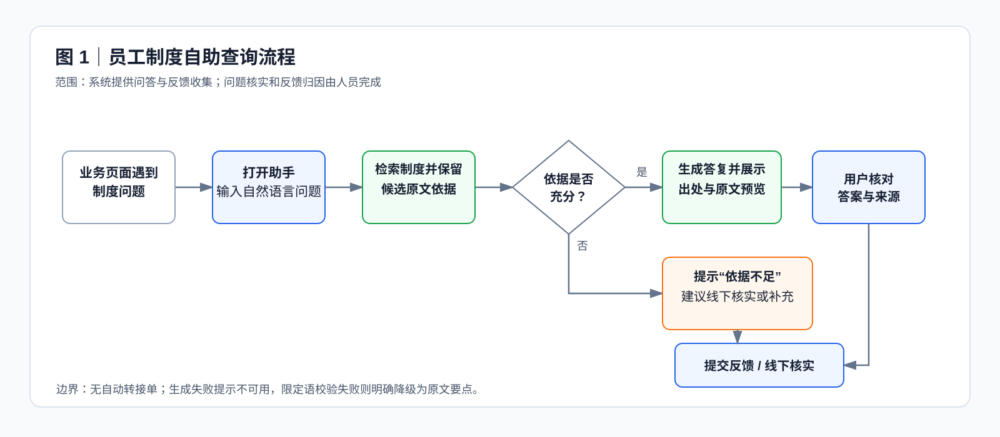
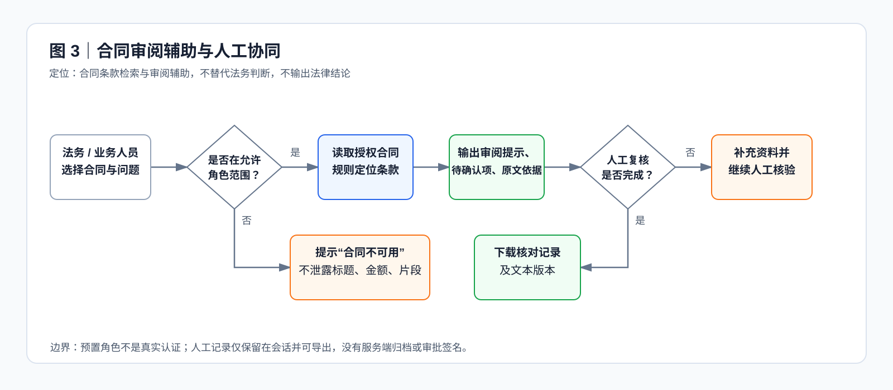
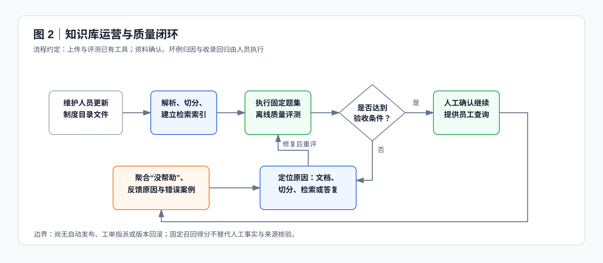

# 鲲坤科技｜企业 AI 协作工作台

面向员工、商务与采购经办人的企业知识辅助应用。它把两类高频、需要依据的工作收敛为可验证闭环：先基于制度原文完成问答与拒答，再围绕合同条款形成核对提示、原文依据与人工确认记录。

当前版本可在本地单实例运行。它不是已上线的企业 SaaS，也不重建人事、财务或 ERP，更不会自动审批、付款或签约。

## 产品概览

| 场景 | 用户得到的结果 | 当前边界 |
|---|---|---|
| 制度自助查询 | 有来源的制度问答；资料无依据时明确拒答 | 基于小规模验证语料与启发式规则，不保证任意问法正确 |
| 合同商务核对 | 12 类条款的审阅提示、待确认事项与页/章节依据 | 规则提取与人工复核，不是自动审查或法务结论 |
| 知识运营 | 文档状态、索引重建、固定评测、反馈及原因汇总 | 反馈归因与案例收录由人工处理，未建设工单流转 |
| 人工交接 | 待复核/已确认/需补充、备注与 Markdown 导出 | 数据仅保存在会话中，无服务端归档、签名或多人审批 |

合同核对覆盖主体、金额、期限/工期、付款结算、账户、保险、履约担保、终止续约、变更签证、质保、验收和违约。未定位条款只表示当前未提取到，不表示条款不存在。

## 两条核心闭环

### 1. 制度问答：从问题到可追溯依据

用户提出具体制度问题；系统完成解析、混合检索与证据门控，并返回带来源的回答。没有足够依据时，系统拒绝编造并提示人工确认。反馈不是“自动修复”，而是进入人工归因和回归验证。

### 2. 合同商务核对：从条款定位到人工确认

合同与制度库隔离管理。系统按允许范围列出合同并定位条款，输出“审阅提示、待确认条款、原文依据”；经办人完成状态标记、备注和导出。上传、查看和导出均不等同于审批通过。

### 知识运营：让回答质量可以持续检查

资料更新后需重建索引，并检查文档状态、固定评测与改写问题；对低质量回答区分资料、检索或生成原因后，再决定是否进入回归案例。

## 已实现范围与访问边界

- 制度问答：文档解析、向量与 BM25 检索、RRF 融合、证据门控、模型生成、来源展示与拒答。
- 合同核对：独立合同库、上传、条款定位、页/章节依据、人工状态和导出。
- 工作台入口：全局助手、场景快捷问题与预置身份。人事、财务、ERP 页面尚未连接真实业务系统。
- 访问范围：合同列表、检索和审阅前检查按允许角色过滤；配置损坏时关闭访问。预置身份仅用于演示，不是真实登录或企业级权限。

所有预置身份都可进入合同页，但只会看到允许范围内的合同；仅法务或领导视角可上传。切换身份、合同或文本版本后，已有审阅结果不会复用。

## 快速验证

建议 Python 3.11。以下命令在仓库根目录执行：

~~~powershell
python -m venv .venv
.\.venv\Scripts\Activate.ps1
python -m pip install -r requirements.txt
Copy-Item .env.example .env
python scripts\rebuild_index.py
~~~

按 `.env.example` 配置模型服务；默认使用 GPT-5.6 系列云端 API 的 `gpt-5.6-terra` 生成回答、使用本机 Ollama 的 `quentinz/bge-large-zh-v1.5:latest` 生成中文语义向量。使用者需在本地 `.env` 填写自己的 `OPENAI_API_KEY`，并准备对应的本机 Embedding 模型；如果账号暂未开通该模型，应先用 Models API 或控制台确认可调用的模型 ID 后替换 `OPENAI_MODEL`。模板同时保留 DeepSeek、千问和智谱的云端接口切换方式；这里的兼容接口表示复用同一套 Chat Completions 参数格式，千问和智谱填写的是各自厂商的 API 地址与模型 ID，不是连接 OpenAI 平台。一次只启用一个回答模型。Local Hash Embedding 只用于离线回归或模型服务不可用时的回退，不等价于语义向量模型。

分别启动后端与前端：

~~~powershell
python scripts\run_api.py
~~~

~~~powershell
python scripts\run_frontend.py
~~~

访问 [工作台](http://127.0.0.1:8501) 或 [API 文档](http://127.0.0.1:8000/docs)。Windows 也可使用根目录的启动脚本。服务默认仅绑定本机，不应直接暴露到公网。

### 使用自己的资料或模型

| 使用方式 | 需要做什么 | 结果预期 |
|---|---|---|
| 运行仓库示例 | 复制 `.env.example` 为本地 `.env`，准备其中配置的模型服务，并执行索引重建 | 使用仓库内的融合制度资料验证完整链路 |
| 使用自己的制度资料 | 将具备使用授权的 PDF、DOCX、Markdown 或 TXT 放入 `data/raw/`，执行索引重建并检查文档状态与改写问题 | 回答应以新资料为依据，原示例问题和结果不再具有可比性 |
| 切换云端模型 | 在本地 `.env` 填写自己的服务地址、模型名与密钥；密钥不得提交 | 语言表达、边界遵循和引用选择可能变化，需重新人工核对 |

`.env` 是每位使用者自己的运行配置，不随仓库提交；`.env.example` 只提供变量名和无密钥的默认值。项目默认采用本机 Ollama 语义 Embedding 与 GPT-5.6 系列云端回答模型；可在离线回归或模型服务不可用时改用确定性的 Local Hash 基线，或改用 DeepSeek、千问、智谱、本机回答模型。回答模型、模型版本、资料内容和索引状态都会影响最终回答。因此，本项目可复现的是运行流程、资料处理和验证方法，而不是承诺不同环境下逐字相同的模型回答。

建议按以下两条路径检查：

1. 在全局助手询问“账号申请由谁发起，试用期目标谁来定”，核对回答来源中的动作与责任人；再询问不存在于制度的设备维修问题，检查是否拒答且来源为空。
2. 使用仓库内的[合成验收合同](data/samples/工程采购合同_验收样本.md)，以法务或领导视角上传，在合同页核对 12 类条款的位置与不完整提示；填写备注后下载核对记录。

## 质量验证与运行约束

~~~powershell
python -m pytest -q
python scripts\run_manual_audit.py --output output/manual-audit.json
python scripts\run_evaluation.py
python scripts\run_ablation.py
~~~

`pytest` 使用独立临时目录，不调用真实模型，也不改写运行反馈或合同。人工审计命令使用实际配置模型和临时索引，结果必须逐题人工核对；脚本不会自动宣称通过。固定评测只衡量文档召回、门控拒答等代理指标，不等价于生产准确率。

更换 Embedding、解析或切块方式后需要重建索引；仅更换回答模型通常不需要。模型不可用或返回空响应时会提示失败，不伪装为正常答复。扫描件目前尚无 OCR 支持。

当前反馈采用单进程文件存储，不能作为多工作进程的并发数据库使用。多人或敏感数据环境需要先补齐服务端身份、资源授权、必要审计及受控部署。

## 路线与项目资料

1. **制度问答**：已实现本地链路，持续检验事实完整性、限定条件与拒答。
2. **合同商务协作**：已实现本地核对、人工备注与导出，下一步验证工程采购任务与独立合同集。
3. **受控试点与交付**：规划中；在资料授权和安全接入具备后，采集真实解决率、初筛耗时、误报遗漏与运营成本，再补充连接器或版本发布机制。
4. **可复制服务**：至少两次独立交付证明共性后，再决定是否建设共享多租户、配额和用量；证据不足时继续独立部署。

- [PRD](PRD.md)：产品背景、边界、行为、Prompt、数据、接口、降级与验收。
- [四阶段路线](docs/SAAS_ROADMAP.md)：当前范围与条件性规划。
- [需求规格](specs/001-saas-productization/spec.md) / [实施计划](specs/001-saas-productization/plan.md) / [任务清单](specs/001-saas-productization/tasks.md)：需求、依赖与执行证据。
- [人工逐题审计](docs/MANUAL_QA_AUDIT.md) / [发布检查](docs/RELEASE_REVIEW.md)：已验证结果、失败过程与未验证项。
- [数据说明](data/README.md)：资料用途与分发边界。
- [迭代日志](docs/ITERATION_LOG.md)：版本问题、改动与历史结果。

三份制度 PDF 由项目维护者参考公开企业资料，结合验证场景融合整理；它们不对应特定企业的现行制度，也不列举具体企业出处。文件中的品牌、联系方式、金额与流程不能作为真实业务执行依据。公开版本不包含本地合同原件、反馈、权限配置、索引或密钥；真实部署应使用适用组织确认的有效资料。

目前没有真实客户效果、生产准确率、节省工时、商业收入或服务等级承诺。
